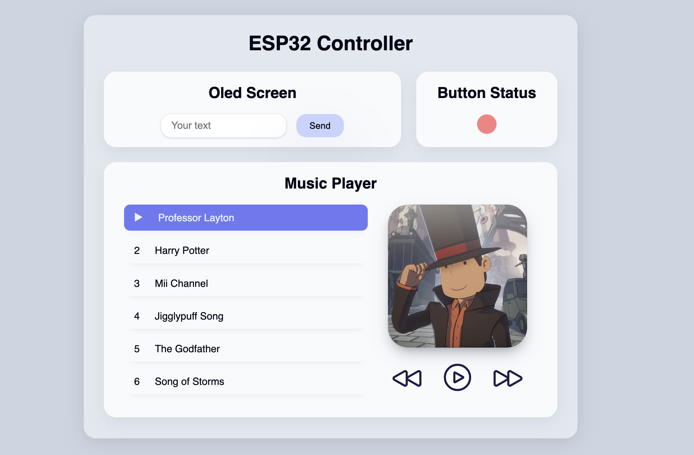

# ESP32 Music Player

## Overview

This project is an ESP32-based music player controlled via a web dashboard.
The ESP32 communicates with the web server using MQTT, with a broker hosted on
a raspberrypi.

Features include:

- Sending text to display on the ESP32 screen from the web dashboard.
- Real-time display of the ESP32 button status on the web dashboard.
- Fully functionnal music player with music selection, play/pause, next and
 previous tracks, and display of song cover. The music is played using a buzzer
 on the ESP32. Current song and player status are saved on the web server, so
 refreshing the browser won't cause data loss.
- Play/pause the music player with the ESP32 button, this will be synced with
 the webdashboard.



## Getting Started

To flash the code onto the ESP32 using `plateform.io`, refer to `esp32/
platformio.ini` for more details. You will need to modify the SSID and WIFI_PASS
in `esp32/main.cpp` to match your WIFI access point.

```bash
# get the compile_commands for use with clangd
pio run --target compiledb
# flash
pio run --target upload
# get the output
pio device monitor
```

Run the web server using Python. By default, the server run on port 8000,
and will try to connect to an MQTT broker. We are hosting a MQTT broker in a
raspberryPI using `mosquitto`. You can adjust the MQTT broker configuration
in `main.py`.

```bash
# install needed packages
pip3 install "paho-mqtt<2.0.0"
# start the webserver and MQTT client
python3 webserver/main.py
```

Then, you can access the web dashboard in your browser at `http://localhost:8000/`.

## Acknowledgements

A big thanks to the following open-source projects: 

- [arduino songs](https://github.com/robsoncouto/arduino-songs): provide songs usable by the arduino buzzer.
- [mosquitto](https://mosquitto.org): an open source MQTT broker.
- [paho-mqtt](https://pypi.org/project/paho-mqtt/): a client library for MQTT.
- [arduino](https://www.arduino.cc): provide a library for interacting with the ESP32 components. 
- [plateformio](https://platformio.org): ecosystem for IoT development.
- [beautiful shadow](https://getcssscan.com/css-box-shadow-examples): handpicked shadow styles.
- [heroicons](https://heroicons.com/): beautiful svg icons.

